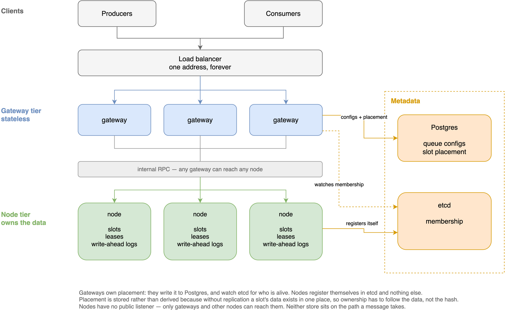
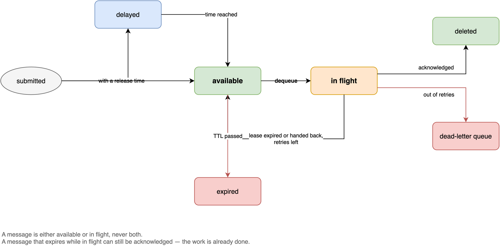

# Ryuk — Distributed Priority Queue

A priority queue service. Producers submit work with a priority and an optional
ordering key; workers pull it, process it, and acknowledge. Ryuk owns the queues,
tracks each message from submission to completion, and reports metrics.

**Design:** [`docs/RYUK_HLD.md`](docs/RYUK_HLD.md) — the whole system, and why.

**Replication:** [`docs/REPLICATION_HLD.md`](docs/REPLICATION_HLD.md) — what a replicated
priority queue looks like, and why this one is not one.

**Component detail:**
[queue engine](docs/lld/01-queue-engine.md) ·
[write-ahead log](docs/lld/02-write-ahead-log.md) ·
[node](docs/lld/03-node.md) ·
[gateway](docs/lld/04-gateway.md) ·
[placement and metadata](docs/lld/05-placement-and-metadata.md) ·
[metrics and testing](docs/lld/06-metrics-and-testing.md) ·
[placement width and safe migration](docs/lld/07-placement-and-safe-migration.md)

## Demo


https://github.com/user-attachments/assets/857ac63f-e85e-4b3f-a016-903aec645cae


A 3m 10s walkthrough against a live cluster:

| | |
|---|---|
| 0:06 | the cluster, and where queues sit on it |
| 0:14 | creating a queue, settings explained |
| 0:25 | sending four: two HIGH, one MEDIUM, one LOW |
| 0:32 | polling one at a time — priority order, ack, nack, redelivery |
| 1:00 | **delayed delivery** — a message scheduled for later, held back until its time |
| 1:24 | **metrics under real load** — a backlog builds past six hundred, then drains |
| 2:03 | distributed queues and slot placement |
| 2:14 | scaling four nodes to six, and the rebalance |
| 2:28 | losing a machine — only its slots go |
| 2:46 | tenancy and theme |

Also at [`docs/demo/ryuk-demo-compressed.mp4`](docs/demo/ryuk-demo-compressed.mp4)
(7.5 MB). The [HyperFrames source](docs/demo/composition) and the capture scripts
rebuild it; see [`docs/demo/VIDEO.md`](docs/demo/VIDEO.md).

## Architecture



Two tiers. Gateways are stateless and interchangeable — any one can serve any
request, so they sit behind one address and scale by adding more. Nodes own the
data: slots, leases and a write-ahead log per slot. Neither metadata store sits
on the path a message takes.



Source: [`docs/ryuk_architecture.drawio`](docs/ryuk_architecture.drawio) (two
pages). Re-export with:

```bash
cd docs
drawio -x -f png --scale 2.5 -p 1 -o diagram-architecture.png ryuk_architecture.drawio
drawio -x -f png --scale 2.5 -p 2 -o diagram-lifecycle.png ryuk_architecture.drawio
```

---

## Running it

```bash
make up                 # postgres, etcd, gateway, 3 nodes
make scale N=6          # add three more; queues rebalance onto them
make down
```

The UI is at <http://localhost:8090>, served by the gateway.

### Running the Go processes yourself

For stepping through the flow in a debugger: only Postgres, etcd and Prometheus
run in Docker, and the gateway and nodes run from your IDE.

```bash
cp .env.example .env       # optional; both binaries read it at startup
make infra                 # postgres :5432, etcd :2379, prometheus :9091
make dev-env               # prints the variables for a run configuration

make run-gateway           # or run backend/cmd/ryuk-gateway from the IDE
make run-node N=1          # and one per node: N=2, N=3 ...
make infra-down
```

Postgres and etcd publish their ports so a host process can reach them, and
Prometheus scrapes `host.docker.internal:8080` instead of a gateway container,
so the metrics charts still fill while the gateway sits on a breakpoint.

Nodes listen on **9110, 9111, …** rather than 9090: Prometheus takes 9091 on the
host, which a second node numbered from 9090 would collide with. Each gets its
own `./data/dev/nodeN`, because a node takes its identity from its data
directory and two sharing one would fight over the same id.

The gateway serves the UI from `frontend/out`, so run `npm run build` in
`frontend/` once if you want it; the API works without it.

#### `.env`

Both binaries read `.env` files at startup, so a local run needs no exported
variables. A value is only ever filled in, never replaced, so the first source
to define one wins:

| | |
|---|---|
| the real environment | beats everything — a run configuration or `FOO=x go run …` |
| `$RYUK_ENV_FILE` | an explicit path |
| `.env.gateway` / `.env.node` | just that service |
| `.env` | both, filling whatever is left |

Start from [`.env.example`](.env.example). Missing files are the normal case in
a container, where the environment is set directly, so nothing fails without
them. `.env*` is gitignored apart from the example.

## Trying it

```bash
T="Authorization: Bearer acme-token"

curl -X POST localhost:8090/v1/queues -H "$T" \
  -d '{"name":"orders","visibilityTimeout":"30s","maxRetries":3,"defaultTtl":"1h"}'

curl -X POST localhost:8090/v1/queues/orders/messages -H "$T" \
  -d '{"payload":"ship-9981","priority":"HIGH","groupId":"user-123"}'

curl -X POST localhost:8090/v1/queues/orders/messages/dequeue -H "$T" -d '{}'

curl -X POST localhost:8090/v1/queues/orders/messages/ack -H "$T" \
  -d '{"receipt":"<from the dequeue>"}'

curl localhost:8090/v1/queues/orders/stats -H "$T"

# settings can be changed on a running queue; placement cannot
curl -X PATCH localhost:8090/v1/queues/orders -H "$T" \
  -d '{"visibilityTimeout":"60s","maxRetries":5}'
```

Changing a setting rewrites nothing already queued. A value read when a message
is **delivered** — the visibility timeout — applies to the next delivery, and
messages already in flight keep the deadline they were given. A value read when
one **fails** — the retry limit — applies to messages already handed out, so
lowering it can dead-letter them on their next failure. Nodes pick the change up
on their next request, because the settings travel with every one.

### Dead-letter queues

A message that runs out of retries is **moved** to the queue's
`deadLetterQueue`, not just counted and dropped.

The node that holds the message cannot do the move itself. It does not know
which node owns the dead-letter queue — placement lives in Postgres, which
nodes deliberately never read. So the node keeps what it gave up on, and the
gateway, which knows both, drains it every few seconds and re-enqueues it
through the ordinary path.

Three things follow from that:

- **The node keeps them until the gateway confirms they landed.** Draining and
  dropping in one call would lose them if the gateway died in between. The cost
  is a possible duplicate in the dead-letter queue, which is a much better
  failure than a missing message.
- **They are written to disk before the gateway is told.** A node that restarts
  in the middle still knows it owes them, and picks up where it left off.
- **No dead-letter queue means the message is never dropped.** It keeps being
  redelivered instead. Dropping it would be a silent loss, and a message that
  will not go away is the honest signal. Only the TTL removes it.

A queue that failures are routed to cannot be deleted while anything still
points at it — the API refuses and names the queues that depend on it.

### Why acknowledge takes a receipt, not a message ID

The brief says "acknowledge by ID". Ryuk hands back a **receipt** instead, and
that is deliberate.

A message can be delivered more than once. If a worker is slow and its
visibility timeout runs out, the message goes to somebody else. If the first
worker then acknowledges by message ID, it deletes work the second worker is in
the middle of doing.

So the receipt names the *delivery*, not the message. It carries the slot, the
message id, and a number that goes up on every delivery. When an acknowledgement
arrives with an old number, the node rejects it. Same reason SQS gives you a
receipt handle. It also carries the slot, which lets any gateway route the
acknowledgement to the right node without a lookup.

A Postman collection covering every endpoint is in
[`docs/postman/`](docs/postman/) — import both files, pick the "Ryuk — local"
environment, and the poll request saves the receipt so acknowledge works
straight after it.

## Two kinds of queue

|  | `distributed: false` (default) | `distributed: true` |
|---|---|---|
| Where it lives | One node, all 16 slots | 64 slots over `placementWidth` nodes (6 by default) |
| Priority and FIFO | **Exact** | Approximate across machines |
| Message counts | **Exact**, one request | Summed across machines |
| If its node dies | Whole queue waits for it | Only its slots; the rest keep serving |

Ordering **within a group** is strict either way, because a group never spans
slots. Two messages that must be ordered should share a group key.

A distributed queue does not use the whole cluster. `placementWidth` (2 to 64,
6 by default) is how many machines it may land on, chosen by the same hash that
picks its owners, so it stays on that many however large the cluster grows. It
bounds what one queue can disturb: a queue that floods is sharing machines with
a handful of others, not with all of them. It is fixed at creation, because
changing it re-derives the candidate set and would move most of the queue.

**Priority is a number from 0 to 100**, ordered exactly — 91 is served before 90.
`HIGH`, `MEDIUM` and `LOW` are accepted as shorthand for 75, 50 and 25, and the
UI offers them plus a custom value. Metrics group the scale into three bands
(0–33, 34–66, 67–100): the engine keeps one counter per band per slot, and 101
series would be neither chartable nor cheap to store.

## Where state lives

Postgres holds what a queue is and where it sits. etcd holds who is alive.
Messages live in node memory, backed by a write-ahead log on that node's disk.
Prometheus holds the history behind the charts.

### Postgres

```sql
CREATE TABLE queues (
    org_id      TEXT        NOT NULL,
    name        TEXT        NOT NULL,
    settings    JSONB       NOT NULL,   -- visibility timeout, retries, ttl,
                                        -- starvation threshold and reserve,
                                        -- max depth, dead-letter queue
    distributed BOOLEAN     NOT NULL DEFAULT false,
    state       TEXT        NOT NULL DEFAULT 'active',  -- active | migrating | deleting
    owner_node  TEXT,                   -- set for a normal queue only
    generation  BIGINT      NOT NULL DEFAULT 1,
    created_at  TIMESTAMPTZ NOT NULL DEFAULT now(),
    updated_at  TIMESTAMPTZ NOT NULL DEFAULT now(),
    PRIMARY KEY (org_id, name)
);

CREATE TABLE slot_placement (
    org_id     TEXT     NOT NULL,
    queue_name TEXT     NOT NULL,
    slot       SMALLINT NOT NULL,
    owner_node TEXT     NOT NULL,
    generation BIGINT   NOT NULL DEFAULT 1,
    PRIMARY KEY (org_id, queue_name, slot)
);

CREATE INDEX queues_owner_idx ON queues (owner_node);
```

Two tables because there are two placement units. A normal queue is placed whole,
so its owner is one column on its row. A distributed queue is placed per slot, so
it gets sixty-four rows.

`generation` rises on every ownership change and prefixes the sequence numbers a
node hands out, so two owners can never issue overlapping ones.

#### Gotcha: why store placement at all, when it is a pure hash?

Rendezvous hashing already tells every gateway which node should own a slot,
with nothing elected and no coordination. So `slot_placement` looks redundant,
and in a system with **replication** it largely is: when the ring moves a slot,
the new owner already holds the data, so routing can follow the hash directly
and the mapping can stay derived.

This system has no replication, which splits one question into two:

| | Answer |
|---|---|
| Where *should* this slot live? | the hash, recomputed from the member list |
| Where *is* its data right now? | `slot_placement` |

They diverge the moment a node joins or leaves. Messages do not move on their
own, so if routing followed the hash alone, adding a node would silently point
the gateway at a machine holding nothing, and the messages on the old owner
would become invisible — depth reading zero while they sit there. **Ownership has
to follow the data.** The hash proposes, the table records, and the rebalancer is
what makes them agree: freeze the old owner, ship, absorb, and only then update
the row and bump the generation.

It is also what makes a lost node honest. The row still names the dead machine,
so the queue returns 503 rather than reassigning to a new owner that would serve
an empty queue.

Worth noting that storing placement is not unusual: Kafka keeps partition
leadership in cluster metadata and Redis Cluster gossips an explicit slot map,
both on top of a hash. The hash gives the target; the metadata is the truth
during and after a move. Replication changes the *cost* of that gap, not whether
it exists.

### etcd

Membership only. One key per node, held by a lease, so a node that stops
refreshing disappears on its own.

```
/ryuk/members/<node-id>  →  {"id":"node-8b5f01fadac2","addr":"172.30.0.4:9090"}
```

The lease TTL is 10s (`RYUK_LEASE_TTL`). Gateways watch the prefix, so a node
joining or leaving reaches every gateway without anyone polling.

Placement is **not** in etcd. Without replication a queue's data exists in one
place, so ownership has to follow the data rather than the hash — which means it
has to be written down, and Postgres is where the queue already lives.

### Prometheus

Prometheus scrapes the **gateway**, never a node. The gateway already collects
from every node and exposes the result at `/metrics`, so scraping the nodes
would duplicate that path and give two things to keep in step.

```
prometheus  --scrape-->  gateway /metrics  --gRPC-->  nodes
     ^
     |  query_range, org label injected server-side
  gateway /v1/queues/{name}/timeseries  <--  the metrics page
```

The browser never talks to Prometheus directly. It asks the gateway, which
builds the PromQL with the org taken from the credential — so one tenant cannot
read another's series by naming its queue. The window (`5m`, `1h`, `6h`, `24h`)
picks the step, and the query set is fixed rather than caller-supplied.

Prometheus is optional. Without `RYUK_PROMETHEUS` the endpoint answers
`available: false` and the page falls back to sampling the live endpoint itself,
which only covers the time the tab has been open. It is at <http://localhost:9091>
with seven days of retention.

## Filling it with data

`make up` gives you an empty system. To get something worth looking at:

```bash
make seed                              # 12 queues per tenant, 150 messages each
make seed QUEUES=40 MESSAGES=500       # more
make seed RESET=1                      # clear what is there first
```

It builds a spread rather than a uniform pile: single-node and distributed
queues at several placement widths, priorities across the whole 0-100 scale,
grouped and ungrouped messages, a few delayed, some acknowledged so the
throughput charts have a rate, some left in flight, and some nacked until they
dead-letter. Two tenants, so the org switcher does something.

3,600 messages across 24 queues takes about three seconds.

## Testing

```bash
make test           # unit tests
make test-race      # the same under the race detector
make integration    # the real stack in Docker, driven through the REST API
```

Five kinds of test, each for a different kind of mistake.

**Engine tests** cover the queue itself with a fake clock, so a visibility
timeout is tested by moving time forward instead of sleeping. Priority order,
FIFO inside a priority, group ordering, retries, dead-lettering, TTL, delayed
delivery.

**Race tests** are the ones that matter most, because the engine is concurrent.
Many producers and consumers hammer one queue while the sweeper runs, and at the
end the test checks the things that must always hold: every message reached
exactly one end state, nothing was acknowledged twice, nothing was handed to two
workers, group order held, the queue is empty. `go test -race` has caught real
bugs here that plain `go test` did not — one of them was `Dequeue` returning a
pointer the slot was still writing to.

**Logic tests** use generated mocks for Postgres, etcd and the node clients, so
routing, placement, caching and the migration protocol can be tested without any
infrastructure.

**Integration tests** are Gherkin scenarios run by godog against a real Docker
cluster through the public API — 28 of them. This is where scaling and failure
live: adding nodes, killing a node, restarting one and checking it replays its
log. See [`integration/`](integration/README.md).

**A load harness** (`backend/tests/harness`) runs many producers and consumers
against a running service and checks the same invariants under real traffic:

```bash
go run ./backend/tests/harness -producers 8 -consumers 8 -messages 500
```

Where correctness depends on timing, the test forces the timing rather than
hoping for it. The migration tests are the clearest example: rather than trying
to crash a gateway at the right microsecond, they check the property directly —
after the first step of a handoff, does the old owner still hold the messages?

## Performance

Measured against the Docker stack on a laptop, using a keep-alive HTTP client:

| | p50 | p95 | p99 | throughput |
|---|---|---|---|---|
| enqueue, 1 client | 1.5 ms | 2.8 ms | 5.9 ms | 580/s |
| enqueue, 32 clients | 6.3 ms | 12.3 ms | 16.8 ms | 4,600/s |
| dequeue, 1 client | 1.4 ms | 2.3 ms | 5.3 ms | 655/s |
| dequeue, 32 clients | 5.8 ms | 13.4 ms | 17.4 ms | 4,700/s |

The design target was p95 under 100 ms, so there is plenty of room. The limit
here is the HTTP and gRPC hop, not the queue: the engine itself does hundreds of
thousands of operations a second per node (`go test -bench . ./backend/queue/logic/engine`).
Adding gateways raises the ceiling, since they hold nothing and any one can serve
any request.

## Layout

```
backend/
  queue/        the node: engine, gRPC server, write-ahead log
    logic/engine/   priority, groups, leases, starvation reserve
  slotting/     which slot a message belongs to -- shared by both services
  gateway/      REST, routing, placement, rebalancing, metric collection
  cmd/          two binaries
frontend/       Next.js UI, static export, served by the gateway
integration/    BDD scenarios against a real Docker cluster
deploy/         compose file and one Dockerfile per service
docs/           design
```

Each service is `controller → logic → entity ← repo`. The engine imports only
`backend/slotting` from the module and nothing else, so it stays a self-contained
core; `make lint-layers` checks that and the other layer rules.

## What I would do next

**Replication.** The biggest gap, and the honest limit of the system today:
there is one copy of every message. A machine that dies takes its slots out of
service until it comes back, and if its disk is gone so are those messages.

Fixing it means putting each slot on three machines instead of one, not
confirming a write until a second machine has it, and replicating the delivery
state — which messages are handed out, how many times each has been tried —
not just the payloads. The write-ahead log already records exactly those events
in order, so it is the thing you would ship.

It also needs **one leader per slot**, because a read here is a write: taking a
message marks it in flight and locks its group. If two replicas both served
reads, the same message would go to two workers. That is the Kafka shape, not
the Cassandra shape. Promotion would be a single row update — `slot_placement`
already stores an owner and a generation number, and that generation is already
the fencing token that stops a demoted owner from carrying on.

The full shape of that design — consensus, what is replicated and what is not,
how a cluster grows, and what it costs — is in
[`docs/REPLICATION_HLD.md`](docs/REPLICATION_HLD.md).

**Smaller things, in the order I would do them:**

- **Extend a lease while working.** A worker that needs longer than the
  visibility timeout currently loses its message. SQS has
  `ChangeMessageVisibility`; it is a small addition and immediately useful.
- **Batch send and acknowledge.** Polling is already batched, sending and
  acknowledging are not. Cuts request count roughly tenfold for busy producers.
- **Deduplication on enqueue.** A retried send creates a second message today.
  An idempotency key would fix it.
- **Redrive from the dead-letter queue.** Messages can go to a DLQ but not come
  back once the bug is fixed.
- **More slots.** 64 is small. With 20 machines the busiest holds about twice
  its fair share, and no queue can ever use more than 64 machines. Going to
  1024 improves balance and removes the ceiling, at the cost of more log files.
- **Placement that knows about failure domains.** Three replicas are worth
  little if all three are on the same rack.

**Deliberately not built:** cluster-wide quotas, load-aware placement (placement
is by hash, not by how busy a machine is), and automatic promotion of a busy
single-node queue to a distributed one — that last one needs the slot count to
be the same for both kinds first.

## Known limits

- **Not replicated, deliberately.** There is one copy of every message. Doing it
  properly means consensus on the write path, a leader per slot, snapshots and
  catch-up for a returning machine, and a coordinator that is the only thing
  allowed to move data — a system several times the size of this one, and most of
  it unrelated to the priority queue the brief asks for. What that design looks
  like, and what it costs, is written up in
  [`docs/REPLICATION_HLD.md`](docs/REPLICATION_HLD.md).
- **A single-node queue waits for its machine.** If the owner is down the queue
  returns 503 rather than being reassigned, because the messages are only there.
  Reassigning would serve an empty queue and quietly lose the real one.
- **Counts on a distributed queue are a point-in-time sum** across machines that
  answered at slightly different instants, so they can be a little off. A
  single-node queue's counts are exact.
- **Priority across machines is approximate.** Within one machine it is exact;
  a distributed queue asks the machine that looks busiest first. Ordering within
  a group is strict either way.
- **Settings changes take up to 30 seconds to reach every gateway**, because
  each caches queue config for that long.
